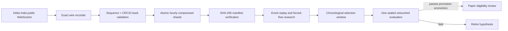

# Delta India event recorder

Status: implemented locally as a research-only public-feed recorder. It has no
credentials, account channel, order channel, execution adapter, or promotion
path.

## Why this exists

The candle scanners tested so far did not establish positive after-cost edge.
This recorder moves the research input below candles: exact trades, incremental
book changes, L2 snapshots, open interest, mark/spot prices, and funding. It is
data infrastructure, not evidence that forced-flow alpha exists.



The first four nodes are implemented. Event replay, feature calibration, and
hypothesis evaluation remain deliberately blocked until sufficient verified
recordings exist.

## Public feed contract

- Endpoint: `wss://public-socket.india.delta.exchange`
- No API key or authentication message is used.
- Default markets: `BTCUSD,ETHUSD,SOLUSD,XRPUSD,AAVEUSD`
- Channels: `trades`, `ob_l2`, `ob_updates`, `ticker`, `funding_rate`,
  `spot_price`, `mark_price`
- `mark_price` subscriptions use Delta's `MARK:<symbol>` convention.
- `ob_l2` is emitted as one subscription entry per symbol because Delta rejects
  multi-symbol `ob_l2` rows. Any subscription acknowledgement containing an
  error fails the whole connection and is recorded before reconnecting.

The older `wss://socket.india.delta.exchange` address is the private endpoint
and is rejected by configuration validation.

## Integrity behavior

For every `ob_updates` message, the recorder:

1. Requires an initial snapshot.
2. Requires the next sequence to equal the previous sequence plus one.
3. Reconstructs both sides of the book using exact price/size strings.
4. Recomputes Delta's documented CRC32 over the top ten asks and bids.
5. Archives the offending raw frame and a control marker if a check fails.
6. Disconnects and resubscribes so the next usable state starts from a fresh
   validated snapshot.

It does not fill a sequence hole, guess a missing delta, or continue from an
invalid local book.

Every exchange record contains:

- exact UTF-8 wire text (`raw_text`) or exact base64 bytes for invalid UTF-8;
- local wall-clock receipt time in nanoseconds;
- local monotonic receipt time in nanoseconds;
- exchange timestamp when present;
- connection ID, session ID, and monotonic event index;
- hard research locks: `research_only=true`, `can_trade=false`, and
  `can_promote=false`.

## Durable storage

Final paths follow:

```text
<root>/<YYYY-MM-DD>/<channel>/
  <channel>_<YYYY-MM-DD_HH>_<session>_<part>.jsonl.(zst|gz)
  <same-name>.manifest.json
```

Writes go to exclusive `.partial` files. Finalization flushes the compression
frame, fsyncs the file, atomically renames it, fsyncs the directory, and writes
an atomic manifest containing record counts plus compressed and uncompressed
SHA-256 hashes. A restart cannot overwrite a shard from the same session.

Any `.partial` file means a process ended before finalization. The dataset-tree
verifier reports that root as failed; it is never silently accepted.

## Install and run

```bash
python -m pip install -e '.[event-recorder]'

python -m vnedge.exchange.delta_event_recorder \
  --output-dir data/delta_events \
  --symbols BTCUSD,ETHUSD,SOLUSD,XRPUSD,AAVEUSD \
  --compression zstd
```

For a bounded operational check:

```bash
python -m vnedge.exchange.delta_event_recorder \
  --output-dir data/delta_events_smoke \
  --symbols BTCUSD,ETHUSD \
  --compression gzip \
  --duration-seconds 30
```

`SIGINT` and `SIGTERM` request a graceful stop: the socket exits, the writer
drains its bounded queue, and open shards are finalized with manifests.

## Verify before research

Verify one shard:

```bash
python -m vnedge.exchange.delta_event_recorder \
  --verify-shard data/delta_events/2026-08-08/trades/<shard>.jsonl.zst
```

Verify a complete recording root, including orphan manifests and crash
partials. The tree audit reports storage integrity and feed continuity
separately; any sequence/checksum/subscription fault makes continuity fail even
though the raw evidence around that fault was stored correctly:

```bash
python -m vnedge.exchange.delta_event_recorder \
  --verify-root data/delta_events
```

Exit code is zero only when all requested integrity checks pass.

## What becomes possible after enough clean data

The recorder supplies the inputs needed to measure, rather than assume:

- aggressive buy/sell flow from trade role;
- reconstructed depth, imbalance, depletion, and replenishment;
- open-interest contraction aligned with aggressive tape bursts;
- perp/spot basis and mark dislocation;
- latency and feed-health distributions;
- causal MFE/MAE after event-defined triggers.

Delta does not expose a public liquidation feed on this contract. A
liquidation-like forced-flow event must therefore be treated as a research
label inferred from coincident open-interest contraction and aggressive flow,
not as an observed ground-truth liquidation.

## Readiness gate

Do not train or backtest event-driven hypotheses merely because files exist.
The research input is ready only after the desired observation window has:

- all finalized shards passing manifest verification;
- no unaccounted `.partial` files;
- no ignored sequence/checksum fault intervals;
- adequate coverage across markets, sessions, and volatility states;
- a frozen chronological selection/untouched split declared before modeling.

The recorder unlocks honest measurement. It does not itself unlock paper or
live trading.
