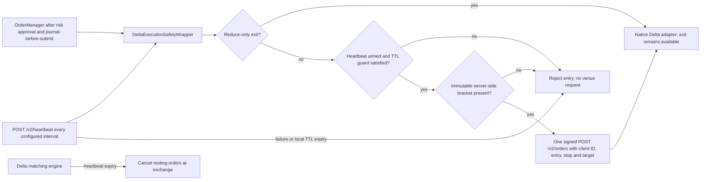
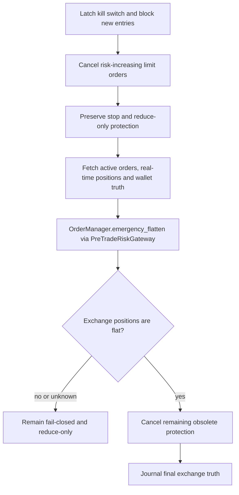

# Delta India Execution Safety Interlock

Status: implemented locally, fully offline-tested, not activated. Live trading
and strategy promotion remain blocked.

## Current API Contract

Delta India's current API does not document a `Cancel After` endpoint. Its
dead-man switch uses:

- `POST /v2/heartbeat/create` to register the protective action
- `POST /v2/heartbeat` with a millisecond TTL to acknowledge/re-arm it
- `ttl=0` to disable the heartbeat

The registered action is `cancel_orders`. The order API also supports
`client_order_id`, `post_only`, `reduce_only`, and bracket stop/target fields on
the initial order request.

Primary reference: <https://docs.delta.exchange/>

## Audit of the Supplied Endpoint Reference

The supplied endpoint list is useful as a checklist but is not an executable
API contract. These safety-relevant corrections were verified against the
current Delta documentation:

| Supplied claim | Current contract / decision |
|---|---|
| `POST /v2/orders/cancel_after` | Not in the current documented contract; VNEDGE uses heartbeat create + acknowledge |
| `POST /v2/heartbeat`, `POST /v2/heartbeat/ack` | Create is `POST /v2/heartbeat/create`; acknowledge is `POST /v2/heartbeat` |
| `GET /v2/users/rate_limit` | Current endpoint is `GET /v2/rate_limits/quota` |
| `POST /v2/users/update_mmp` and reset | Current methods are `PUT`; MMP is only for registered market makers |
| `POST /v2/users/margin_mode` | Current method is `PUT` |
| `POST /v2/positions/auto_topup` | Current method is `PUT` |
| Cancel all, then directly close all | Unsafe as a default bot flow: it can remove stops before the position is flat and bypass the risk gateway |

VNEDGE now has authenticated, exactly-signed reads for active orders, real-time
positions, wallet balances, and rate-limit quota. The observed exchange payload
is SHA-256 summarized and journaled, but observation alone never marks
reconciliation clean.

## Implemented Flow



## Invariants

- A direct live risk-increasing call to `DeltaRestExecutionAdapter.submit_order`
  is rejected. Live entries must use the safety wrapper.
- Every live entry requires an immutable `ServerSideBracket` carried in the
  journaled `OrderIntent`.
- The native adapter sends the entry and its bracket fields in the same signed
  request. It does not create a naked-position window by adding the stop later.
- The journaled `client_order_id` is sent verbatim and is limited to Delta's
  documented 32-character maximum.
- A heartbeat failure, expired local TTL, insufficient TTL guard, disabled
  exchange process, or unavailable journal blocks new entries.
- Reduce-only exits bypass the entry interlock. A dead-man failure cannot trap
  the bot inside a position.
- Disabling sends `ttl=0`; an unexpected disable failure is surfaced and never
  treated as success.
- The authenticated client signs the exact canonical body with a fresh Unix
  timestamp on every request, including the exact sorted query string. No
  timestamp or signature is reused.
- Venue-truth reads are evidence only. They cannot clear the fail-closed
  reconciliation latch without a separate local-versus-exchange comparison.
- Panic cancellation selects risk-increasing limit orders only. It explicitly
  preserves stop and reduce-only orders until flattening is confirmed.

## Components

| Component | Responsibility |
|---|---|
| `ServerSideBracket` | Frozen stop/target contract and directional geometry validation |
| `DeltaAuthenticatedSafetyClient` | HMAC signing, heartbeat endpoints, atomic protected-order POST |
| `DeltaDeadmanConfig` | Frozen heartbeat ID, products, TTL, acknowledgement interval and entry guard |
| `DeltaDeadmanSnapshot` | Immutable armed/expired/failure state exposed to monitoring |
| `DeltaExecutionSafetyWrapper` | Entry interlock, heartbeat lifecycle, journal evidence and exit passthrough |
| `DeltaRestExecutionAdapter` | Contract sizing, idempotent venue reconciliation and native order mapping |

## Fail-Safe Panic Sequence



VNEDGE intentionally does not expose `POST /v2/positions/close_all` as a
shortcut. Emergency flattening already creates idempotent reduce-only market
orders through `OrderManager` and the mandatory `PreTradeRiskGateway`. A direct
venue shortcut would violate the repository's no-bypass invariant.

## Default Timing

```text
TTL:                   15 seconds
Acknowledgement:        5 seconds
Minimum TTL at entry:   5 seconds
Unhealthy count:        1
```

The interval plus entry guard cannot exceed the TTL. These values are frozen
at construction; changing them requires a restart.

## Activation Boundary

This module does not create a Delta runtime route and does not enable capital.
Before any activation, VNEDGE still requires:

1. a promotion-grade strategy edge;
2. the existing three live-mode confirmations;
3. a trade-only, IP-restricted credential;
4. an exchange reconciliation pass;
5. an operator-observed dead-man drill showing venue-side order cancellation;
6. an operator-observed protected-entry drill showing the server-side stop and
   target in exchange truth.

Until those checks exist, the wrapper is a tested safety primitive only.
