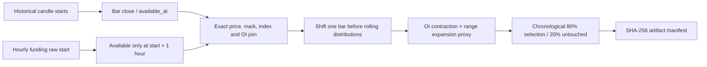

# Delta Forced-Flow Historical Panel

Status: local research data builder. It creates no orders, signals, paper
routes, or promotion verdicts.

## Purpose

The builder retrieves Delta India's documented public historical series for a
perpetual market:

- traded candles: `BTCUSD`, `ETHUSD`, etc.;
- mark candles: `MARK:<symbol>`;
- open-interest candles: `OI:<symbol>`;
- settled funding candles: `FUNDING:<symbol>`;
- the exact spot-index symbol returned by `/v2/products/<symbol>`.

Delta documents all three synthetic history prefixes. They are not guessed or
configurable aliases in VNEDGE. Reference: <https://docs.delta.exchange/>

## Causal Timeline



The cascade threshold at bar `t` is calculated only from bars strictly before
`t`. The supplied prototype used full-sample 5th/95th percentiles, leaking the
future distribution into every historical candidate. That implementation was
not suitable for a causal backtest.

Funding is always fetched at its native one-hour resolution and joined only
from its conservative settlement availability time. It is never treated as a
five-minute series and never forward-filled from the raw candle start.

## Output Columns

Alongside price, mark, index, OI and settled funding, the panel contains:

- `basis` and `basis_bps`;
- `range_bps` and `ret_bps`;
- `oi_chg` and `oi_chg_pct`;
- the causal OI and range thresholds used at each bar;
- `forced_flow_score`;
- nullable `cascade_flag`;
- `cascade_side`, explicitly named as a liquidation **proxy**.

Missing OI is represented as an unavailable nullable result, never as
`cascade_flag=False`. Source coverage below the configured threshold fails the
panel quality report.

## Run

```bash
python -m vnedge.research.delta_forced_flow_panel \
  --symbols BTCUSD,ETHUSD \
  --resolution 5m \
  --days 180 \
  --end 2026-08-08T22:20:00+00:00
```

Per symbol, this creates:

- `<symbol>_5m_selection.parquet`;
- `<symbol>_5m_untouched.parquet`;
- `<symbol>_5m_manifest.json`.

The command reports cascade counts for the selection partition only. It does
not calculate return expectancy or inspect untouched economics.

`--end` must not be in the future. The requested first and final closed bars
must both be present, and no row may have `available_at` after the requested
end. A timeout, missing page, incomplete boundary, or insufficient source
coverage aborts that symbol instead of writing a partial panel.

## Claim Boundary

OI contraction plus a large candle is compatible with forced liquidation but
does not prove it. Deleveraging, position closure, calendar effects, and data
quality can create the same candle signature. Actual forced-flow confirmation
still requires recorded liquidation/trade/L2 events.
