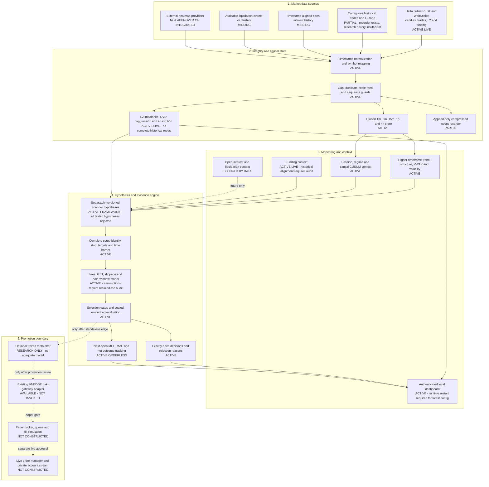

# VNEDGE Professional BTC/ETH Scalper — Corrected Target Architecture

## Status and intent

This is a target architecture, not a description of a deployable trading bot.
VNEDGE currently has a functioning research and monitoring sidecar but no
validated alpha, paper route, broker, or order manager. Components below are
explicitly labelled so peer reviewers can distinguish implemented evidence from
future design.

## Architecture

## Proposal-to-implementation mapping

| Proposed capability | Current VNEDGE state | Decision |
|---|---|---|
| Exchange DOM/order book | Live top-depth store works | Keep; historical event replay still required |
| Footprint, volume profile and CVD | CVD/aggression live; candle volume features available | Do not call this a historical footprint until event tape exists |
| Liquidation heatmap | No trusted source or timestamped history | Block scanner use; define provider/data contract first |
| Funding | Live context exists | Audit historical timestamps before funding scanner |
| Open interest | Not implemented as a validated causal series | Add only with exchange/source provenance and gap rules |
| 15m/1h/4h context | Implemented with closed-candle aggregation | Keep |
| Three-signal confluence counter | Not implemented and not recommended as a generic vote | Require a preregistered hypothesis with attributable conditions |
| Absorption/liquidity-break entry | Live metadata exists, historical proof does not | Block until event-level replay is complete |
| Post-only limit entry | No broker or fill model | Build queue/fill simulator before paper use |
| 0.25-1% risk and 5-15x leverage | Not enabled | Leverage cannot create edge; size only after paper promotion |
| Scale-out and trailing | Exit contracts support targets; trailing is disabled | Independently replay any scale/trailing policy before use |
| Daily 2-3% loss stop | No account/execution route | Implement in paper risk gateway, not the research scanner |
| Trade review loop | Journals, outcomes, attribution and dashboard work | Keep; do not continuously tune frozen windows |

## Corrections to the supplied design

### Confluence is not a vote count

Requiring “three out of five” inputs can double-count correlated evidence. BTC
trend, ETH momentum, CVD, imbalance, and volatility expansion may all describe
the same underlying move. Each scanner must define a causal setup identity and
prove incremental value for every added condition. A generic confluence score
must not replace attribution or untouched validation.

### Limit orders do not guarantee cheaper execution

A post-only order can miss, lose queue priority, or fill only when price is
moving adversely. Maker assumptions require a queue-aware fill simulator using
event-level book and trade data. Until then, research should continue using the
conservative taker/slippage model where appropriate.

### Tight stops and leverage do not create expectancy

Stops inside ordinary one-minute noise increase churn. Leverage multiplies
profit, loss, fees, liquidation exposure, and model error; it cannot turn
negative gross expectancy positive. Stop placement must be tied to a frozen
structural invalidation and evaluated before leverage or position sizing.

### External heatmaps require provenance

Screenshots or reconstructed heatmaps are not backtest data. A liquidation
source needs event timestamps, symbol mapping, retention rules, outage/gap
behavior, licensing permission, and a causal snapshot contract before it can
enter a scanner.

## Implementation phases

### Phase 0 — restore trustworthy current state

1. Restart the dashboard and research sidecar so they load the checked-in YAML,
   where all rejected scanners are disabled.
2. Repair the known one-minute candle gaps and rerun unchanged data-quality
   checks.
3. Investigate the historical context `ValueError` rejections.
4. Audit modeled fees against realized Delta account fees before paper mode.

### Phase 1 — next candle-testable hypothesis

Preregister `range_compression_breakout_v1` using only data already available:
closed candles, causal volatility percentiles, volume expansion, higher-timeframe
context, and CUSUM as a frozen confirmation. It must be tested standalone before
regime filters or meta-labeling.

### Phase 2 — complete the research data plane

1. Record contiguous trades and L2 updates across BTCUSD and ETHUSD.
2. Add reproducible replay snapshots and gap manifests.
3. Add timestamp-aligned open interest and liquidation events only after source
   audit.
4. Validate whether live imbalance, CVD and absorption improve forward outcomes.

### Phase 3 — event-driven scanner hypotheses

Only after Phase 2 can VNEDGE honestly preregister failed-breakout absorption,
trapped aggressive flow, liquidation sweep, or queue-toxicity scanners.

### Phase 4 — paper execution

Paper routing requires a separately reviewed order lifecycle, post-only rejection
handling, partial fills, queue assumptions, position sizing, portfolio exposure,
daily loss limits and kill switches. It remains downstream of positive untouched
scanner evidence.

## Promotion gates

Before paper mode, require at minimum:

- Positive after-cost untouched expectancy.
- Untouched profit factor above 1.30.
- Average net above +3 bps per trade.
- Adequate observations and acceptable frequency.
- No dependence on one market, month, or short regime unless explicitly scoped.
- Zero unresolved candle/event gaps in the evaluated path.
- No repainting and next-bar causal entry.
- Realistic fill, fee and slippage sensitivity.
- `can_trade=false` and `can_promote=false` until a separate review changes them.

## Current conclusion

The proposed modular direction is sound, but its execution and alternative-data
layers are future components. Today VNEDGE is a live research monitor with a
strong causal backtester and no validated alpha. The correct next build is the
range-compression hypothesis plus data-quality repair—not leverage, a generic
three-signal score, or live order placement.
