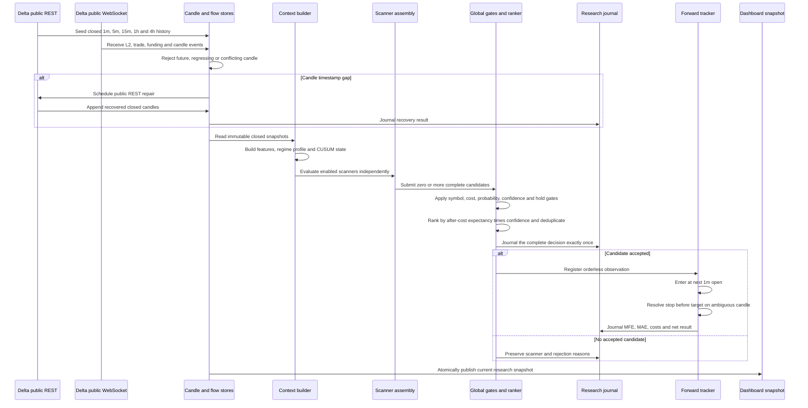
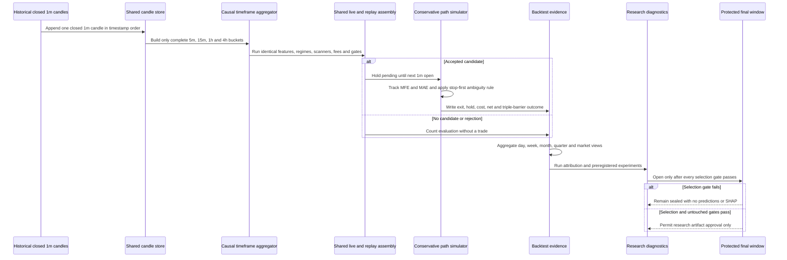

# VNEDGE Delta India Scalper — Implemented Architecture and Code Flow

Peer-review baseline: 7 August 2026  
Repository state reviewed: `feat/scanner-forward-evidence` at `817af4d`  
Runtime role: local, research-only shadow service  
Execution authority: none

This document describes the code that is implemented and running, not the
aspirational HFT diagrams that preceded it. The authoritative safety facts are:

- `can_trade = false` and `can_promote = false`;
- the service creates no account client, broker, order manager, or order route;
- L2 and trade flow are context-only and cannot create, suppress, or execute a
  signal;
- every decision uses proven-closed candles;
- accepted research candidates are measured from the next 1-minute open;
- shadow and replay use the same context, scanners, predictor, fees, and gates;
- current after-cost evidence is negative, so paper promotion is blocked.

## 1. Current operational status

Observed from the local `/delta-scalper` endpoint at `2026-08-07T02:20:00Z`:

| Item | Observed state |
|---|---:|
| Connected markets | BTCUSD, ETHUSD |
| Shadow uptime | 34,322 seconds |
| Closed-candle evaluations | 177 |
| Accepted alerts / completed outcomes | 0 / 0 |
| Current regime | Expanding on both markets |
| L2 | Fresh, context-only |
| Order route | Absent |
| Can trade / promote | No / No |

Latest full replay, generated `2026-08-06T16:31:17Z`:

| Metric | Result |
|---|---:|
| Trades | 19,521 |
| Net | -124,298.69 bps |
| Average | -6.37 bps per trade |
| Profit factor | 0.4021 |
| False-signal rate | 64.63% |
| Positive markets / months | 0 / 0 |
| Maximum market trade share | 72.71% |
| Same-bar stop/target ambiguity | 5.42% |
| Source data-quality gate | Failed |

The system is working as a research recorder and causal evaluator. The present
trading hypothesis is not profitable after configured costs.

## 2. Deployed component architecture

```mermaid
flowchart LR
    Delta["Delta public APIs"] -->|"REST seed and gap repair"| Runtime["Shadow runtime"]
    Delta -->|"Public WebSocket"| Runtime

    subgraph Sidecar["Single-process asyncio research sidecar"]
        Runtime --> Candles["Closed multi-timeframe candle store"]
        Runtime --> Flow["Bounded L2 and trade-flow store"]
        Runtime --> Funding["Funding state"]
        Candles --> Context["Context builder<br/>indicators, regime, trend, volatility,<br/>session, CUSUM alarm, bars-since-shift,<br/>shift-age bucket, return and vol scores"]
        Flow -->|"Confirmation metadata only"| Context
        Funding --> Context
        Context --> Regime["Regime profile and causal CUSUM"]
        Regime --> Scanners["Momentum and imbalance-fade scanners"]
        Scanners --> Predictor["Deterministic move estimator"]
        Predictor --> Fees["Fee model<br/>Delta India round-trip costs applied<br/>to every candidate and expected net bps"]
        Fees --> Gates["Causal expectancy, probability and confidence gates"]
        Gates --> Rank["Ranking and exactly-once deduplication"]
        Rank --> Journal["Append-only research journal"]
        Rank --> Forward["Orderless next-bar forward tracker"]
        Forward --> Journal
        Runtime --> Snapshot["Atomic latest JSON snapshot"]
        Journal --> Snapshot
    end

    Snapshot --> Bridge["Scanner dashboard bridge"]
    Bridge --> Dashboard["Local dashboard and delta-scalper API"]
    Gates -.->|"Available, not invoked"| Risk["Existing risk gateway adapter"]
    Risk -.-> NoRoute["No broker and no order submission"]
    Candles --> Replay["Causal historical replay"]
    Replay --> Research["Attribution, sweeps, labels, meta-model and SHAP"]
    Research --> Dashboard
```



The runtime is one local asyncio process outside VNEDGE's main execution
kernel. An adapter can translate a `SignalCandidate` into the existing risk
gateway's `OrderIntent`, but the shadow process never invokes it.

## 3. Closed-candle live flow



## 4. Historical replay and research flow



Historical replay has no historical L2, CVD, or funding unless event-level data
actually exists. Missing microstructure fields are unavailable, never invented.

## 5. Every implemented code module

### Core engine

| File | Responsibility | Output and safety behavior |
|---|---|---|
| `architecture.py` | Machine-readable topology. | Safety manifest embedded in snapshots. |
| `types.py` | Frozen contracts for candles, context, L2, regimes, exits, and candidates. | Rejects invalid OHLC, timestamps, price geometry, probability ranges, and any triggering/execution role for L2. |
| `config.py` | Strict frozen Pydantic schema over YAML. | Forbids unknown fields, non-research mode, live orders, and promotion. |
| `candle_store.py` | Bounded closed-candle storage and higher-timeframe aggregation. | Exact duplicates are idempotent; future, regressing, conflicting, or partial aggregates are rejected. |
| `flow_store.py` | Top-five L2 imbalance and 15-second aggressor flow. | Emits imbalance, z-score, CVD, aggression, absorption, depth, midpoint, and optional sequence health. |
| `change_point.py` | Deterministic two-sided CUSUM. | Journaled shift flags/scores only; never a gate. |
| `regime.py` | Base regime, orthogonal profile, and shared feature calculations. | One causal feature definition for live and replay. |
| `context.py` | Joins immutable candles, funding, L2, features, regime, and CUSUM. | Returns `MarketContext`; L2 older than two seconds is visibly stale. |
| `predictor.py` | Deterministic v1 move/probability/confidence heuristic. | Returns `MoveEstimate`; this is not a trained model. |
| `fee_model.py` | Maker/taker, GST, DETO, slippage, Scalper Offer and hold-window model. | Returns a complete expected cost breakdown. |
| `scanners.py` | Momentum Burst and candle-based Imbalance Fade. | Zero or one complete candidate per scanner; L2 copied as metadata only. |
| `signal_generator.py` | Context, scanner isolation, gates, ranking, dedup and journal fail-closed behavior. | Returns `EngineDecision`; includes an unused risk adapter. |
| `forward_tracker.py` | Measures accepted alerts without positions. | Exactly-once next-open outcome with MFE, MAE, costs, net and barriers. |
| `backtester.py` | Causal one-position-at-a-time historical replay. | Complete trade rows/report; gaps reset state and fail data quality. |
| `validation.py` | CPCV, DSR, PBO, fee sensitivity and untouched helpers. | Never manufactures confidence when observations/configs are insufficient. |
| `factory.py` | Builds the shared live/replay dependency graph from YAML. | Same context, fees, scanners and gates in both paths. |

### Runtime, exchange, and dashboard

| File | Responsibility |
|---|---|
| `src/vnedge/runtime/delta_scalper_shadow.py` | REST seed, public WS, gap repair, L2/funding updates, closed-candle evaluation, forward outcomes, and atomic snapshots. It creates no private client or broker. |
| `src/vnedge/exchange/delta_ws.py` | Public WebSocket subscriptions, heartbeat, reconnect, parsing, callbacks, and symbol normalization. |
| `src/vnedge/dashboard/scanner_live.py` | Merges live snapshot, backtest, attribution, sweep, change-point, meta-label, CUSUM, and SHAP artifacts. |
| `src/vnedge/dashboard/app.py` | Authenticated local UI and `/delta-scalper`; trade and promotion remain false. |
| `configs/delta_scalper.yaml` | Frozen engine, fee, feature, CUSUM, scanner, and promotion parameters. |

### Research programs

| Module | Implemented research behavior | Guardrail |
|---|---|---|
| `delta_scalper_backtest.py` | Downloads/caches candles; reports trade, day, week, month, quarter, rolling, market, false-signal, fee and 1x/5x/10x/25x/50x arithmetic views on $100 margin. | Next-open, stop-first; leverage omits liquidation and is not deployable risk evidence. |
| `delta_scalper_attribution.py` | Scanner, regime, market, side, hour, exit, hold, numeric buckets, and combined loss cells. | Final 20% aggregate-only; live and replay never pooled. |
| `delta_scalper_threshold_sweep.py` | One candidate ledger and 20 independent preregistered gate simulations. | Frozen tail opens only after all selection gates pass. |
| `delta_scalper_regime_sweep.py` | Scanner-specific regime allow-list experiments. | Predictor, fees, entries and exits remain unchanged. |
| `delta_scalper_change_points.py` | Offline PELT plus causal CUSUM comparison. | PELT is future-aware and permanently research-only. |
| `delta_scalper_cusum_interactions.py` | CUSUM window × scanner × symbol × trend × volatility cells and pivots. | ≥100 trades for eligible cells; final tail never decomposed. |
| `delta_scalper_triple_barrier_labels.py` | Exports simulator or Route A outcomes to Parquet. | Explicit labels win; time-stop MFE recovery is opt-in and approximate. |
| `delta_scalper_meta_label.py` | Regularized logistic meta-label experiment with net or barrier labels. | 70/10/20 chronology and embargo; model only after untouched success. |
| `delta_scalper_lightgbm_meta.py` | LightGBM fit, early stop, selection threshold search, and sealed tail. | 60/10/10/20 chronology; absent L2/CVD/funding not fabricated. |
| `delta_scalper_lightgbm_shap.py` | Global, grouped, local and interaction SHAP reports and plots. | Selection-only; guarded Booster bundle; no live integration. |

## 6. Contracts and state invariants

`Candle.ts` is a UTC close time. Price must be positive; high/low must contain
open/close; volume cannot be negative. Store observation time must prove close.

`L2Confirmation` enforces imbalance in `[-1, 1]`, aggression in `[0, 1]`,
non-negative depth, `context_only = true`, `used_for_signal = false`, and
`used_for_execution = false` at construction.

A `SignalCandidate` is complete at creation: scanner, symbol, side, decision
close, price reference, stop, target ladder, time stop, expected hold/move,
expectancies, probability, confidence, maker preference, and metadata. Invalid
long/short geometry or incomplete trailing settings are rejected.

```text
rank_score = fee_adjusted_expectancy_bps × confidence
dedup_key  = scanner_id : symbol : side : decision_timestamp
```

Deduplication is in memory; the JSONL journal is the durable evidence boundary.
If a selected candidate cannot be journaled, the selection is cleared.

## 7. Ingestion, candles, and L2 state

The runtime seeds BTCUSD and ETHUSD for 1m, 5m, 15m, 1h, and 4h. Current
lookbacks are roughly 3, 5, 14, 60, and 120 days. Live L2 calculates weighted
top-five depth imbalance. Trades create signed USD flow from aggressor side.
The rolling flow window is 15 seconds, with a 240-observation imbalance history.
Absorption is high aggressive flow relative to depth with little midpoint move.

Candle callbacks ignore seed overlap/regression, detect timestamp gaps, and
schedule public REST repair. Each timeframe holds at most 700 closed bars.
Replay builds higher timeframes only when every constituent minute is present;
partial buckets with gaps are discarded.

## 8. Features, regimes, and change points

Shared features include 1/5-bar returns, ATR and percentile, Bollinger width,
ADX, realized volatility, candle body/direction/wicks, volume z-score, relative
volume, candle-location delta proxy, prior 12-bar high/low, breakout distances,
9/21 EMA gap, 9/21/30 stack, 1h 12/36 EMA context, 4h return, and RSI(14).

The base regime prioritizes funding extreme, then volatility expansion, then
EMA/efficiency/macro-aligned trending up/down, otherwise quiet. Insufficient
history is unknown.

The orthogonal closed-5m profile labels:

- strong trend when ADX ≥ 30, 20/50 EMA separation ≥ 0.8 ATR, and direction
  agrees;
- range when ADX ≤ 22, otherwise weak trend;
- high volatility at ATR percentile ≥ 0.75, low at ≤ 0.30, else medium;
- UTC session as Asia, Europe, overlap, or US.

The causal CUSUM consumes closed-5m log return and log true-range bps. Defaults
are 50-bar warmup, 200-bar baseline, 0.50 z drift, 8.0 z alarm, and 6-bar
cooldown. Its baseline excludes the current observation and duplicate context
builds are idempotent. All CUSUM outputs remain metadata.

## 9. Scanner logic

### Momentum Burst v1

Requires 31 bars, volume z-score ≥ 0.75, body ratio ≥ 0.55, and a close breakout
≥ 0.4 bps beyond the prior 12-bar high/low. Long is rejected in trending-down
and short in trending-up. Stop is `0.55 × ATR`, clamped 6–14 bps. Target 1 is
70% and target 2 is 100% of expected move. Time stop is 1,680 seconds.

### Order Flow Imbalance Fade v1

The name is historical: the trigger is candle-based, not an L2 trigger. It
requires 31 bars, wick ratio ≥ 0.48, absolute 5-bar stretch ≥ 7 bps, and RSI ≥
68 for short or ≤ 32 for long. It runs only in quiet/expanding. Stop is `0.65 ×
ATR`, clamped 7–16 bps. Targets are 65% and 100% of expected move; time stop is
1,680 seconds.

### Deterministic predictor

```text
probability = clip(0.52 + 0.14 × strength + 0.035 × volume_z
                   + 0.05 × body_ratio + regime_alignment, 0.50, 0.88)
confidence  = clip(0.45 + 0.28 × strength + regime_alignment, 0.00, 0.95)
move_bps    = clip(ATR_bps × (0.75 + 0.35 × strength), 6, 45)
```

Expected hold is 8 minutes in expansion and 14 minutes otherwise. These values
are heuristic scores, not calibrated probabilities.

## 10. Costs, expectancy, gates, and ranking

YAML defaults: maker 2 bps, taker 5 bps before 18% GST, plus 1.5 bps slippage
per leg. DETO and Scalper Offer are disabled unless explicitly supplied. BTCUSD
and ETHUSD use a 30-minute eligibility window.

```text
raw_expectancy = probability × expected_move
               - (1 - probability) × stop_distance
fee_adjusted_expectancy = raw_expectancy - modeled_round_trip_cost
```

Global gates require allowed market, fee-adjusted expectancy ≥ 8 bps,
probability ≥ 0.70, confidence ≥ 0.60, and expected hold within the time stop.
Survivors rank by after-cost expectancy × confidence. Scanner exceptions are
isolated; context exceptions reject the whole evaluation. Every stage records
microsecond timing and reasons.

## 11. Forward outcome and triple barrier

The decision-candle close is only a reference. The tracker waits for the next
1m candle, rebases stop/target distances to its open, and updates MFE/MAE.

Exit priority is stop, then first target, then vertical time stop. Stop wins if
both price barriers occur inside one OHLC candle. The outcome records expected
and realized net bps, actual hold costs, MFE/MAE, regime, CUSUM, L2 quality, and
triple-barrier fields. Label `1` means target 1 first; stop/time stop are `0`.
No position or account balance exists.

## 12. Replay, validation, and promotion

Replay allows one pending/open trade at a time. A timestamp gap clears active
state, resets history, and increments missing/unresolved counters. Data quality
passes only if both are zero. Reports include complete trades, PF, drawdown,
frequency, fee compliance, ambiguity, rolling expectancy, calendar periods,
market concentration, untouched split, fee sensitivity, and leverage arithmetic.

Paper mode remains blocked until there are at least two positive markets, PF
above 1.2 after costs, at least two positive months, no market/profitable-month
share above 70%, complete data, causal parity, no repainting, and compliant hold
windows. Success permits paper review only, never direct live trading.

## 13. Meta-label and SHAP state

LightGBM uses 12,680 fit, 2,344 early-stop, 2,229 selection, and 2,268 protected
trades. Selection baseline is -6.82 bps/trade with PF 0.363; ROC AUC is 0.572.
The apparent best threshold, 0.475, retained only nine trades at +2.94 bps and
PF 1.414. It failed source quality, minimum 300 trades, and allowed frequency
reduction. No threshold was selected, final data stayed sealed, and no
deployable bundle was written.

SHAP explains the selection diagnostic only. Scanner identity dominates; CUSUM
is small and several regime categories are zero. The protected 2,268 trades have
neither predictions nor SHAP. Nothing is loaded by the live scanner.

### Profit-model research progression

The proposed first three phases have already been executed inside the guarded
causal harness:

| Phase | Implementation state | Evidence |
|---|---|---|
| Route-A triple-barrier labels | Complete | `delta_scalper_with_tb_labels.parquet` exports simulator-authoritative target-first labels. |
| Chronological LightGBM meta-labeling | Complete | Selection ROC AUC 0.572; no threshold passed sample, frequency, data-quality, and economic gates. |
| Global, grouped, local, and interaction SHAP | Complete | Scanner identity dominates; CUSUM is small; protected final window remains unopened. |
| Untouched profitability test | Correctly not run | No selection threshold qualified, so evaluating the final 2,268 trades would leak validation evidence. |

Running the identical Route-A, LightGBM, and SHAP commands again against the
same dataset will not create new information. The next valid experiment is
Phase 4 feature enrichment, one preregistered family at a time:

1. path-dependent regime origin;
2. L2-CVD divergence, only after event-level historical tape exists;
3. causal BTC-to-ETH and ETH-to-BTC short-horizon lead-lag;
4. volume/dollar bars as a separately versioned sampling experiment.

Each feature family must use a new nested discovery/selection split. The final
protected tail stays sealed until a configuration independently clears the
selection requirements: adequate trades and daily frequency, positive results
in at least two markets, PF above 1.2 at the configured gate and preferably
1.3-1.4 for promotion review, average net above 3-4 bps per trade, and repaired
source-data quality. Microstructure features cannot be backfilled from candle
OHLCV and must not be zero-filled as if observed.

## 14. Persistence and dashboard artifacts

| Artifact | Producer and use |
|---|---|
| `research/live_research/delta_scalper_engine_latest.json` | Atomic shadow snapshot for UI. |
| `logs/delta_scalper/delta_scalper_shadow.journal.jsonl` | Append-only decisions, repairs, and outcomes. |
| `research/live_research/delta_scalper_backtest_latest.json` | Full replay evidence and research input. |
| `research/live_research/delta_scalper_attribution_latest.json` | Loss attribution. |
| `research/live_research/delta_scalper_threshold_sweep_latest.json` | Gate sweep. |
| `research/live_research/delta_scalper_regime_sweep_latest.json` | Hard-regime experiment. |
| `research/live_research/delta_scalper_change_points_latest.json` | PELT/CUSUM diagnostics. |
| `research/live_research/delta_scalper_cusum_interactions_latest.json` | Five-way interaction report. |
| `research/live_research/delta_scalper_with_tb_labels.parquet` | Flat barrier-label training data. |
| `research/live_research/delta_scalper_meta_label_latest.json` | Logistic meta-label report. |
| `research/live_research/delta_scalper_lightgbm_meta_latest.json` | Guarded LightGBM report. |
| `research/live_research/delta_scalper_lightgbm_shap_latest.json` | SHAP and interaction report. |

## 15. Failure and degradation behavior

| Failure | Response |
|---|---|
| REST seed failure | Report failure; never invent history. |
| WS disconnect | Heartbeat/reconnect and resubscribe. |
| Candle gap | REST repair and journal result. |
| Invalid candle | Store rejects it. |
| Stale/missing L2 | Mark stale/unavailable; candle evaluation can continue. |
| Context exception | Typed rejection; no scanner runs on incomplete context. |
| One scanner exception | Journal it and continue peer scanners. |
| Gate failure | Journal explicit reasons. |
| Journal write failure | Clear selected candidate and fail closed. |
| Historical gap | Reset state and drop unresolved observation. |
| Stop and target in one bar | Stop-first and mark ambiguous. |
| Research gate failure | Keep frozen data sealed; write no deployable model. |
| Missing/corrupt model bundle | Explicit guarded-loader error; no fallback or zero-fill. |

## 16. Verification coverage

The repository suite reports 1,930 passing tests and one warning. Delta tests
cover candle closure/aggregation/gaps, context parity, fees, scanners, gates,
dedup, journaling failure, forward paths, safety manifest, public WS behavior,
dashboard merging, replay summaries, attribution, sweeps, PELT/CUSUM,
triple-barrier export, chronological meta-model gates, guarded Booster loading,
SHAP attribution/interactions/additivity, artifacts, and frozen-window safety.

## 17. Known gaps for peer review

1. **No positive edge.** More frequency currently amplifies loss.
2. **Backtest data quality failed.** Repair and rerun the unchanged baseline.
3. **OHLC path ambiguity is 5.42%.** Tick/event replay is required for truth.
4. **No historical L2 replay.** Candle history cannot validate live L2 value.
5. **Predictor scores are heuristic and overconfident, not calibrated.**
6. **Fade scanner naming is misleading because its trigger is candle-based.**
7. **Fees/slippage are assumptions, not realized venue/account commissions.**
8. **Replay omits portfolio concurrency, margin, liquidation, queue position,
   partial fills, and post-only rejection.**
9. **In-memory dedup is process-local; journal durability is separate.**
10. **Nine diagnostic meta-model trades are not statistical evidence.**
11. **Any paper route must be a separately reviewed change through VNEDGE's
    existing journaled risk and execution kernel.**

## 18. Reproduction commands

```bash
.venv/bin/python -m vnedge.runtime.delta_scalper_shadow

.venv/bin/python -m vnedge.research.delta_scalper_backtest \
  --start 2025-01-01 --symbols BTCUSD,ETHUSD --scalper-opted-in

.venv/bin/python -m vnedge.research.delta_scalper_attribution
.venv/bin/python -m vnedge.research.delta_scalper_change_points
.venv/bin/python -m vnedge.research.delta_scalper_cusum_interactions
.venv/bin/python -m vnedge.research.delta_scalper_threshold_sweep --scalper-opted-in
.venv/bin/python -m vnedge.research.delta_scalper_regime_sweep --scalper-opted-in
.venv/bin/python -m vnedge.research.delta_scalper_triple_barrier_labels
.venv/bin/python -m vnedge.research.delta_scalper_meta_label --scalper-opted-in
.venv/bin/python -m vnedge.research.delta_scalper_lightgbm_meta
.venv/bin/python -m vnedge.research.delta_scalper_lightgbm_shap
.venv/bin/python -m pytest -q
```

## 19. Peer-review conclusion

The causal and safety architecture is strong: closed-candle decisions, shared
live/replay code, explicit costs, next-bar outcomes, conservative path
resolution, fail-closed journaling, frozen validation, and no order route. The
weakness is economic: the scanners and heuristic probability model have no
after-cost edge. The correct next step is to repair source data, rerun the
unchanged baseline, then perform sparse preregistered research without opening
the protected tail. Paper execution is not yet justified.
