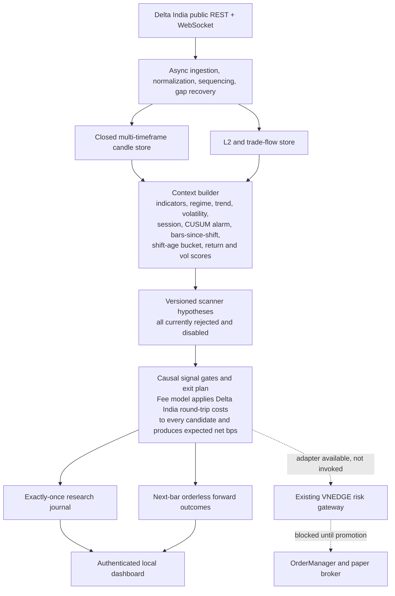
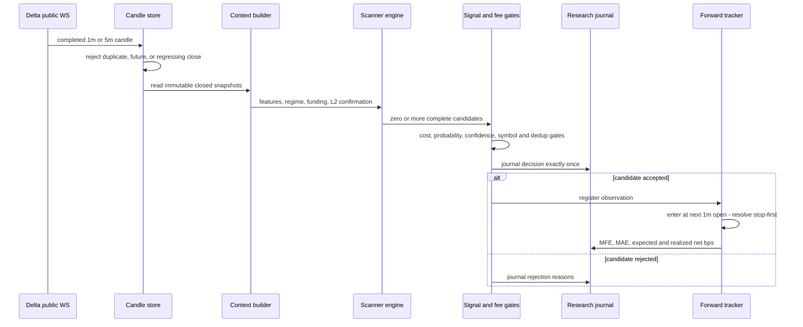
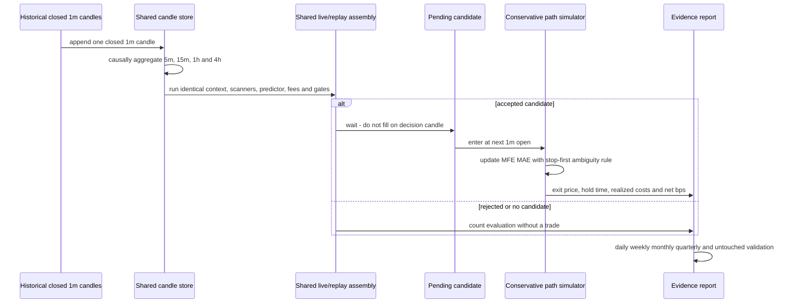

# VNEDGE Delta India Scalper Engine — System Architecture

For the peer-review inventory of every implemented module, runtime path,
research program, safety boundary, current evidence, and known gap, see
[Implemented Architecture and Code Flow](DELTA_SCALPER_PEER_REVIEW.md).

Version 1.0, implemented 5 August 2026.

## Deployed topology

The deployed service is one asyncio process, but it is a research sidecar. It
does not instantiate an account client, `OrderManager`, or broker. Describing
it as already embedded in the main execution kernel would be inaccurate.

## Closed-candle signal sequence

## Live/replay parity

`build_delta_scalper_assembly()` is the single construction path for the
context builder, regime engine, move predictor, scanners, fee model, and final
gates. Both the live shadow service and offline replay load the same strict
YAML configuration and call that factory. Historical replay omits L2 because
candle history cannot reconstruct an event-level book; live L2 remains an
attached confirmation field and never changes the candle trigger.

## Current component status

| Layer | Implementation | Status |
|---|---|---|
| Data | Public WS, REST backfill, candle gaps, sequence checks | Active |
| Intelligence | Shared features, regimes, hierarchy context, legacy predictor | Active research support |
| Decision | Three assembly scanners plus one paired research hypothesis, costs, ranking, exits | Available; all rejected and disabled |
| Research | Causal replay, untouched split, fee sensitivity, forward outcomes | Active |
| Control | Strict YAML, snapshots, journal, authenticated dashboard | Active |
| Existing risk core | Risk adapter using the existing gateway | Available, not invoked |
| Execution | OrderManager, account stream and broker | Not constructed |

## Promotion boundary

The supplied diagram's final happy-path step—submission to the existing risk
gateway—is a future paper-mode boundary, not current behavior. The 2025-to-date
untouched evidence fails the configured profitability and data-quality gates.
Consequently the machine-readable architecture manifest and dashboard enforce
`order_route_present=false`, `can_trade=false`, and `can_promote=false`.

## Detailed stage ownership

The supplied sequence places fee and move enrichment after scanner evaluation.
In the implemented interface, legacy scanners ask the shared deterministic
`MovePredictor`; the hierarchical scanner uses an explicitly uncalibrated,
non-promotable structural prior. Every scanner asks `DeltaFeeModel` while
constructing its complete immutable candidate. The signal generator then
applies global gates, ranking, and dedup. This keeps every candidate
self-describing and makes replay/live candidates identical.

L2 and CVD are attached to scanner outputs as confirmation metadata. They
are not consulted by the entry predicates, even for Imbalance Fade. This is an
intentional correction to the supplied diagram and preserves causal replay
parity when historical event-level books are unavailable.

## Error handling and edge cases

| Condition | Behavior |
|---|---|
| Duplicate or regressing candle | Rejected before evaluation |
| Missing candle interval | Pause that stream, REST backfill, resume next close |
| Context construction error | Fail closed, journal typed rejection |
| One scanner raises | Record typed scanner error; continue other scanners |
| No candidate | Journal normal no-selection decision |
| Duplicate candidate key | Suppress and record duplicate reason |
| Journal unavailable | Remove selected candidate; no forward route |
| L2 stale or sequence unhealthy | Mark confirmation status; never trigger execution |
| Stop and target in one replay bar | Resolve stop first and flag ambiguity |
| Historical L2 unavailable | Replay candles only and report L2 as unused |

## Timing annotations

Every decision contains monotonic microsecond measurements for context
construction, each enabled scanner, global fee/probability/confidence gates,
ranking/dedup, and total generation time. These values are observability only:
they never enter features, ranking, or replay results. The latest trace and WAL
write status are available in the authenticated `/delta-scalper` response.

## Equivalent research replay flow

