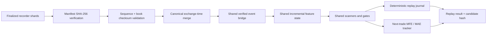

# Deterministic Delta event replay

VNEDGE replays finalized Delta public-event recorder shards through the same
`DeltaVerifiedEventBridge` and `EventDrivenTriggerLayer` used by the live
research path. Replay has no broker, risk gateway, credential loader, or order
router. Every replay artifact is explicitly `research_only` and `can_trade=false`.

## Flow



Validation completes before any event reaches a scanner. A bad shard hash,
sequence gap, checksum mismatch, unsupported code version, or forbidden holdout
overlap stops the run before research decisions are produced.

## CLI

Feature-only replay:

```bash
python -m vnedge.replay \
  --event-root data/delta_events \
  --symbols BTCUSD \
  --from 2026-08-01T00:00:00+00:00 \
  --to 2026-08-02T00:00:00+00:00 \
  --scanner none
```

Flow-imbalance replay uses the currently locked scanner prior and gates:

```bash
python -m vnedge.replay \
  --event-root data/delta_events \
  --symbols BTCUSD,ETHUSD \
  --from 2026-08-01T00:00:00+00:00 \
  --to 2026-08-02T00:00:00+00:00 \
  --scanner flow
```

Absorption replay requires explicit exchange tick sizes. VNEDGE refuses to
guess them:

```bash
python -m vnedge.replay \
  --event-root data/delta_events \
  --symbols BTCUSD,ETHUSD \
  --from 2026-08-01T00:00:00+00:00 \
  --to 2026-08-02T00:00:00+00:00 \
  --scanner absorption \
  --tick-size BTCUSD=0.5 \
  --tick-size ETHUSD=0.05
```

The default CLI derives the Git commit and refuses a dirty working tree. During
local development, pass an explicit content-version identifier with
`--code-version` so artifacts cannot masquerade as a clean commit.

## Holdout manifest

`--sealed-holdout` requires a manifest and fails if the requested window
overlaps a declared development interval. The requested window must also be
fully contained by a declared sealed interval. Conversely, a window declared
sealed cannot be replayed without the explicit `--sealed-holdout` flag.

```json
{
  "schema_version": "vnedge.event_replay_holdout.v1",
  "development_windows": [
    {
      "name": "selection-2026-08",
      "start_ts_us": 1785522600000000,
      "end_ts_us": 1786127400000000,
      "symbols": ["BTCUSD", "ETHUSD"]
    }
  ],
  "sealed_windows": [
    {
      "name": "untouched-2026-09",
      "start_ts_us": 1788201000000000,
      "end_ts_us": 1790793000000000,
      "symbols": ["BTCUSD", "ETHUSD"]
    }
  ]
}
```

## Interpretation

The deterministic hash covers accepted candidates only; performance timings
are deliberately excluded because wall-runtime varies between machines.
Candidate outcomes use the next recorded trade as the causal entry, then track
tick-path MFE, MAE, stop, first target, time-stop, modeled costs, and net bps.
An incomplete replay tail is recorded but excluded from economic expectancy.

Replay evidence is not proof of live fillability. Queue position, packet loss
outside the recorder, and venue execution latency still require shadow and
paper validation after a scanner passes sealed research gates.
