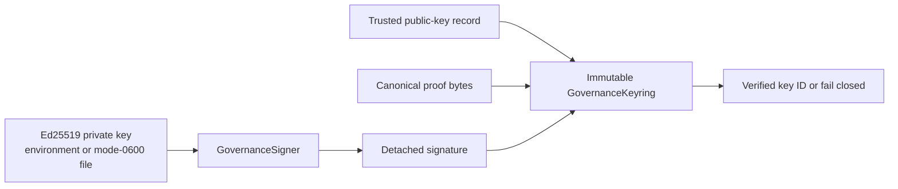

# Governance Cryptography

`vnedge.governance.crypto` is the Phase 2 cryptographic identity foundation for
promotion proofs. It has no trading, promotion, or journal side effects.

## Trust Boundary

An `issuer_pubkey` embedded in a future proof is not self-authenticating. The
keyring derives its Ed25519 fingerprint and requires an exact match with a
pre-trusted record. It also checks issuer identity, activation/expiry windows,
and revocation before verifying the detached signature.

## Implemented

- Ed25519 key generation, PEM loading, and detached signing.
- Encrypted PKCS8 private-key support.
- Private-key environment loading without logging key material.
- Private-file loading through a no-follow file descriptor.
- POSIX private-file permission enforcement: group/other bits must be zero.
- Canonical unpadded base64url public keys, signatures, and 256-bit nonces.
- Stable key IDs: `ed25519:<sha256 of raw public key>`.
- Immutable keyring rotation and explicit revocation.
- Timezone-aware key activation and expiration windows.
- Fail-closed verification for malformed, untrusted, inactive, revoked,
  issuer-mismatched, or invalid signatures.

`cryptography` is now an explicit runtime dependency rather than an accidental
transitive dependency.

## Deliberately Not Integrated Yet

The existing `VerifiableProof` remains SHA-256 tamper-evident only. This module
must be integrated in the next reviewed slice by adding the public key, nonce,
algorithm, and Ed25519 signature to the canonical proof envelope.

Single-use nonce persistence is also not implemented here. An in-memory nonce
set would fail open after restart. Replay protection must consume the nonce in
the same durable SQLite transaction that accepts the proof or journal event.

`TrialManifest`, `ContextSnapshot`, and signed SQLite journal envelopes remain
unchanged in this foundation slice.

## Key Handling Rules

- Never commit private keys. `*.pem`, `*.key`, and `secrets/` are gitignored.
- Production private keys should come from the runtime secret store or a
  mode-`0600` mounted file.
- Keep the signing key away from research agents and exchange credentials.
- Rotate by adding the new public key before issuance switches, then revoke the
  old key after every proof it signed has expired.
- Do not remove an old public key while unexpired historical proofs still need
  verification; mark it revoked when immediate invalidation is intended.
