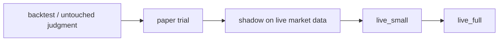
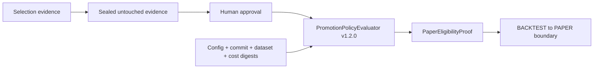

# Live Promotion Ladder

VNEDGE does not go live because a signal looks exciting. A lane advances one
rung at a time, with evidence attached at each step.

The code contract lives in `src/vnedge/runtime/live_ladder.py`.

## Rungs

| Target rung | Minimum evidence |
| --- | --- |
| `paper` | A valid, unexpired `PaperEligibilityProof`, bound to the exact strategy and market. Its hash-linked chain must contain passed selection evidence, passed untouched evidence, explicit human approval, and digests for the strategy config, source commit, dataset window, and cost model. |
| `shadow` | Human approval after paper, at least 14 paper days, at least 10 paper trades, net-positive paper PnL, max paper drawdown <= 6%. |
| `live_small` | Human approval, cleared pre-live checklist, three live gates open, clean reconciliation, writable WAL, kill switch clear, at least 7 shadow days, at least 10 shadow trades, net-positive shadow result, shadow PF >= 1.05, max shadow drawdown <= 6%. |
| `live_full` | Human approval, cleared pre-live checklist, three live gates open, clean reconciliation, writable WAL, kill switch clear, at least 7 live_small days, at least 5 live_small trades, net-positive live_small result, max live_small drawdown <= 3%. |

These thresholds are intentionally conservative defaults. Changing them is a
new version of `vnedge.governance.PromotionPolicy`, not an operator mood change
during a drawdown. Governance artifacts and ladder decisions report the policy
version used.

## Paper Proof Boundary

`BACKTEST -> PAPER` no longer accepts caller-provided booleans such as
`params_locked` or `untouched_judgment_passed`. The only accepted input is a
`PaperEligibilityProof` issued after `PromotionPolicyEvaluator` verifies:

Every proof contains its previous proof hash, policy digest, creation and
expiry timestamps, and strategy/market identity. Deserialization rejects a
payload whose canonical SHA-256 no longer matches.

SHA-256 provides tamper evidence and deterministic chain linkage; it does not
authenticate the human or service that issued the payload. The Ed25519 signer
and trusted-keyring foundation now lives in `vnedge.governance.crypto`, but the
proof-envelope integration and SQLite nonce/journal migration remain separate
follow-up work.

## Non-Negotiables

- No rung skipping.
- Live modes still require the existing three gates:
  `trading_mode`, `live_trading_enabled=true`, and the exact confirmation
  phrase.
- `run_pre_live_checklist` remains mandatory before live. The ladder does not
  replace it; it feeds the "lower rungs validated" decision with concrete
  evidence.
- `emergency_reduce_only` is not a promotion rung. It exists only to reduce or
  flatten live exposure.
- A positive backtest, agent-council vote, scanner rank, TradingView-style
  signal, or UI badge is not live approval.

## Operator Pattern

1. Hash the frozen strategy config, source commit, sealed dataset window, and
   cost model.
2. Create the selection, untouched, and human-approval proof chain.
3. Ask `PromotionPolicyEvaluator` to issue a `PaperEligibilityProof`.
4. Build `LiveLadderEvidence` with the exact strategy ID, market, and proof.
5. Call `evaluate_live_ladder(evidence)`.
6. If blocked, fix the evidence gap. Do not override the ladder.
7. If allowed for a live rung, run the pre-live checklist again immediately
   before starting the live process.
